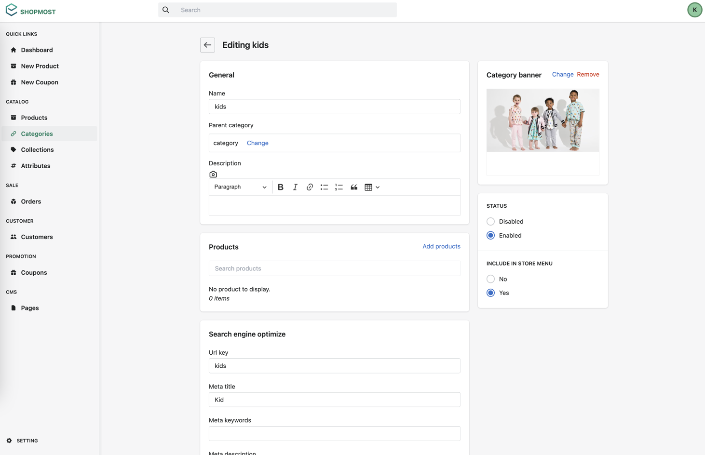

# Shopmost – An Open-Source Node Ecommerce Platform Introduction

Welcome to the Shopmost. A Node Ecommerce Platform!

Shopmost is an open-source [Node ecommerce platform](/) that helps developers developing their e-commerce store. Based on a module system, Shopmost is a flexible with both admin panel and front store are extensible.

Shopmost also offers rich functionality. Enabling merchants to develop a web store meets the business requirements.

Shopmost is free and open-source. The source code is available on [GitHub](https://github.com/kkumarcodes/shopmost)

## Technology stack

Shopmost's highly modular structure is a result of several open source technologies embedded into a stack. These open source technologies are composed of the following components:

### NodeJS

[Node.js](https://nodejs.org/en/) is an open-source server side runtime environment built on Chrome's V8 JavaScript engine. It provides an event driven, non-blocking (asynchronous) I/O and cross-platform runtime environment for building highly scalable server-side application using JavaScript

### PostgreSQL

[PostgreSQL](https://www.postgresql.org/) is a powerful, open source object-relational database system. It has more than 15 years of active development and a proven architecture that has earned it a strong reputation for reliability, data integrity, and correctness. Shopmost requires PostgreSQL 13 or higher.

### React

[React](https://reactjs.org/) is a free and open-source front-end JavaScript library for building user interfaces based on UI components. Shopmost implements server-side rendering of React components with hydration to provide a fast, performant experience and SEO optimization.

### GraphQL

[GraphQL](https://graphql.org/) is a query language for APIs and a runtime for fulfilling those queries with your existing data. Shopmost uses GraphQL and React to build a flexible and extensible front-end.

:::info

Check [this document](/getting-started/system-requirements) for more detail about system requirement of Shopmost.
:::

## Backend - React Ecommerce Dashboard

Heavy inspired by Shopify, we have a fully-featured admin panel using React that allows you to manage your store.

The admin panel is also designed to be extensible and customizable. Developers can easily add new features to the admin panel without modifying the core source code.

## Front store view - React Graphql Ecommerce 

The Shopmost frontend is designed to optimize storefront customization, with highly extensible themes being the central customization mechanism.

:::info
Check out the theme documentation [here](/theme/theme-overview).
:::
