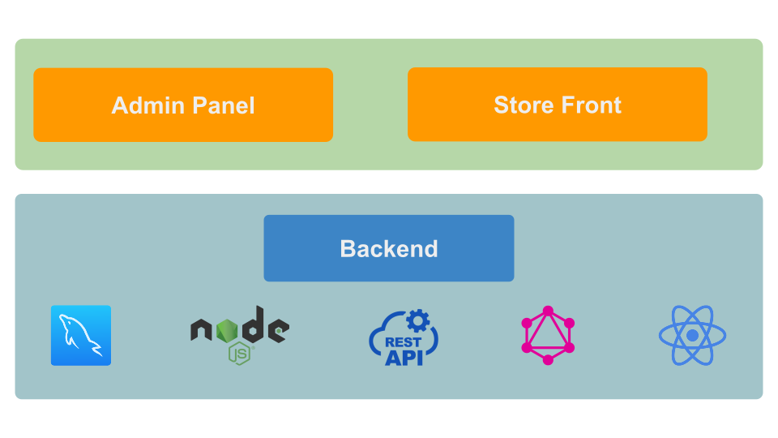
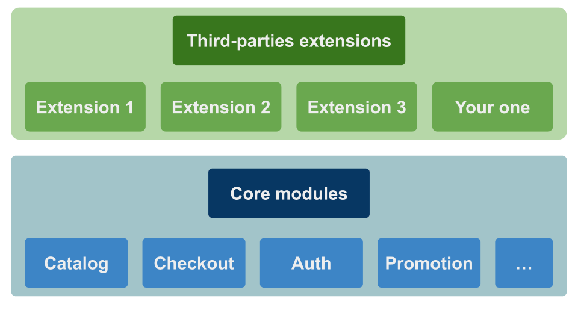

# Architecture Overview

Shopmost was developed with Node and PostgreSQL. The project is divided into 2 parts: the backend and the frontend.

It is a monolithic application, which means that the backend and the frontend are in the same project.

Shopmost provides both REST API and [GraphQL API](https://graphql.org/) for the frontend to communicate with the backend.



## Module System

Shopmost is a modular application and it supports modularity. It means that all functionality is implemented and delivered in components that are known as Modules.

A module is a logical group – a directory containing controllers, services, views – that are related to a specific business feature. In keeping with Shopmost’s commitment to optimal modularity, a module encapsulates one feature and has minimal dependencies on other modules.



## Project Folder Structure

A Shopmost project contains node_modules, caching files, configuration files, media and extension. Let’s take a look to the directory structure:

```bash
├── .shopmost
├── .log
├── config
│     ├ default.json
├── extensions
├── media
├── node_modules
├── themes
├── package-lock.json
└── package.json

```
### The `.shopmost` Folder

This folder contains the built files for production. [ReactJS components](https://reactjs.org/) and assets files will be generated by the [build command](/docs/development/knowledge-base/command-lines) and stay here automatically.

### The `.log` Folder

This folder contains the log file. The log file is where we store the logging information of all the even happening in your application.

### The `config` Folder

This folder contains the configuration files. You can learn more about the configuration in [this document](/docs/development/knowledge-base/configuration-guide).

### The `extensions` Folder

This folder contains modules developed by third-party and developer. Check [this document](../module/extension-development) to understand more the module structure.

### The `media` Folder

This folder contains media files like product images, category images.

### The `node_modules` Folder

This is the default node_modules from [NodeJS](https://nodejs.org/en/). It contains the packages from NodeJs and vendors. Shopmost core package is also located in this folder.

### The `themes` Folder

This folder contains themes developed by third-party and developer. Check [this document](../theme/theme-overview) for more information.