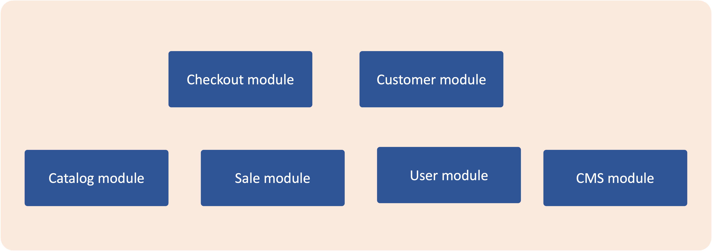
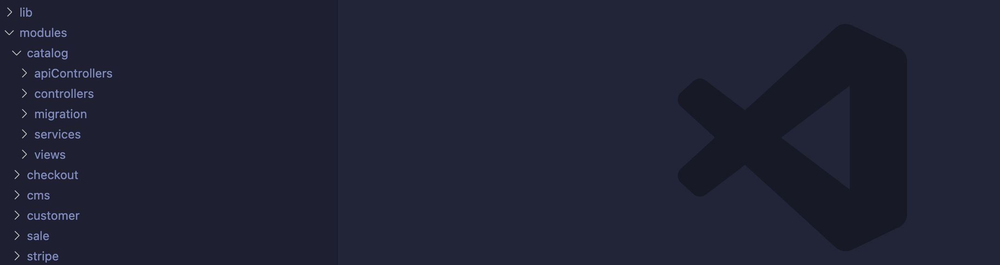

# Module Overview

Shopmost is a modular application and it supports modularity. It means that all functionality is implemented and delivered in components that are known as Modules.

A module is a logical group – a directory containing controllers, services, views – that are related to a specific business feature. In keeping with Shopmost’s commitment to optimal modularity, a module encapsulates one feature and has minimal dependencies on other modules.

Modules and themes are the units of customization in Shopmost. Modules provide business features, with supporting logic, while themes strongly influence user experience and storefront appearance. Both of theme have a life cycle that allows them to be installed, deleted, and disabled. From the perspective of both merchants and extension developers, modules are the central unit of Shopmost organization.

The purpose of a module is to provide specific product features by implementing new functionality or extending the functionality of other modules. Each module is designed to function independently, so the inclusion or exclusion of a particular module does not typically affect the functionality of other modules.



## Module Folder Structure

Below is the folder structure of a module:

```bash
modules
└── catalog
    ├── api
    │   ├── global
    │   │   └── authMiddleware.js
    │   └── createProduct
    │           ├── route.json
    │           ├── validateProductMiddleware.js
    │           └── [validateProductMiddleware]saveProductMiddleware.js
    ├── pages
    │   ├── admin
    │   │   └── postCreate
    │   │       ├── route.json
    │   │       ├── Form.jsx
    │   │       ├── General.jsx
    │   │       ├── Variants.jsx
    │   │       └── index.js
    │   ├── global
    │   │   └── authMiddleware.js
    │   └── frontStore
    │       └── postView
    │           ├── route.json
    │           ├── GeneralInformation.jsx
    │           ├── Price.jsx
    │           ├── Media.jsx
    │           └── index.js
    ├── migration
    │   └── Version_1.0.0.js
    ├── services
    │   └── ProductValidator.js
    ├── bootstrap.js
    └── packages.json
```


A module is a directory that contains 5 parts:

1. `Api`: The `api` contains a list of the RESTful api and its middleware functions and route definition. Check [this document](./../knowledge-base/middleware-system) to learn more about the middleware functions.
2. `Page`: The `pages` folder contains list of pages. This folder contains the route definition, middleware function and the React components for UI rendering.
3. `Migration`: The `migration` folder contains the database migration files used for module installation and upgrade. Normally, we need this when our module needs to create a new table or add a new column to an existing table.
4. `Services`: The `services` folder contains Javascript class/function that provides some functionality.
5. `bootstrap.js` file. This file will be executed once the application is starting.
6. `packages.js` file. An extension can have its own dependencies. We will use the NPM workspace to manage the dependencies of the extension. We will describe this in more detail in [this document](./extension-development).

## Module Locations



There are two types of modules:

1. Core module: Those modules are developed and maintained by the Shopmost team. They are located in @shopmost/shopmost/src/modules
2. Extension: Those modules developed by a third party/developer. They are located in the ‘extensions’ folder at the root level. We will learn more about the extension in the next sections.